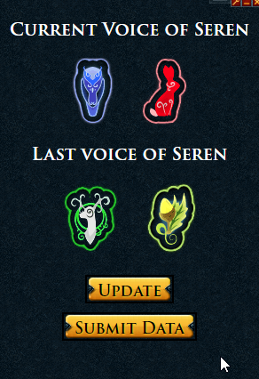

# Voice of Seren

Crowdsourced data to share the current Voice of Seren.

As with all crowdsourced information, it is reliant on the community. The more users able to contribute, the better. With a critical mass of contributors across all time zones, the VOS could easily be updated in a timely fashion for all users! Eventually, the project may grow to tagging roles in Discord automatically. All of this potential depends on you. If you are available on the hour change, please consider helping updating the VOS!

## How to Install & Required Settings

To install Voice of Seren copy & paste this link into Alt1's browser app:
`alt1://addapp/https://nadyanayme.github.io/VoiceOfSeren/dist/appconfig.json`

If you do not have Alt1 Toolkit installed already you can [download it from runeapps.org](https://runeapps.org/alt1). In order for Voice of Seren to work make sure your Runescape settings for Game and UI Scale settings are set to `100%` as this is required for Alt1 to be able to read your game screen.

## Features

- See the current Voice of Seren & vote in a consensus for the current voices
- Automatically contributes data as long as the app is open (can be minimized) when you are in Prif (can opt-out of automatic scanning)
- Active VoS are in Title Bar (exactly the same as D&D Notifications)
- Coming Soon: Be alerted when a favorited voice is active!

## Privacy Concerns / Data Transparency

The app sends the following information to the server:

- Two strings (one for each clan)
- A UUID string that is generated for each user. The primary purpose of this is to track the health of the app, aka "how many unique users we have submitting data each hour". UUID's are not permanently stored on the server, cannot be used to identify any users (eg. is not tied to your RSN or any personal information in any way), and are deleted by the server at the conclusion of each VoS hour. It also gives us a way to fight against malicious actors/data tampering if that ever becomes an issue. This is a privacy-focused alternative to using something like Google Analytics

## My Other Plugins

To see my other Alt1 plugins [click here](https://github.com/NadyaNayme/NyusPluginDirectory)
